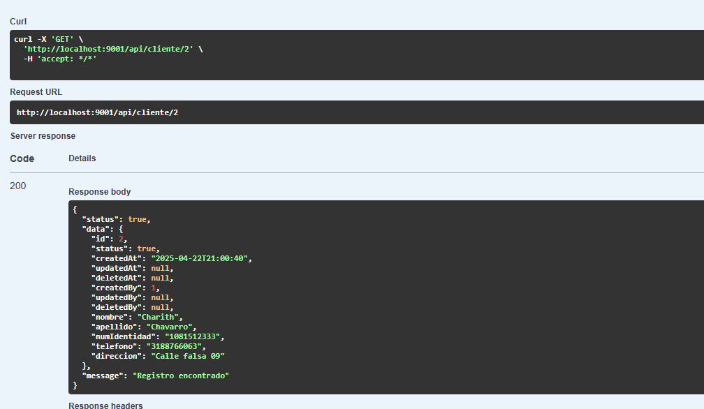

# Historia de Usuario - HU1: Componente de fecha y hora

## Descripción

El objetivo de esta historia de usuario es crear un componente reutilizable que permite seleccionar la fecha y hora para poder realizar reservas. 
## Imagenes


## Estructura

```tsx
interface DateTimePickerProps {
  selectedDate?: string;
  selectedTime?: string;
  onDateChange: (value: string) => void;
  onTimeChange: (value: string) => void;
}

const DateTime: React.FC<DateTimePickerProps> = ({
  selectedDate,
  selectedTime,
  onDateChange,
  onTimeChange,
}) => {
  const [showDatePicker, setShowDatePicker] = useState(false);
  const [showTimePicker, setShowTimePicker] = useState(false);

  const formatTime = (isoString?: string) => {
    if (!isoString) return 'Seleccionar hora';
    try {
      const date = new Date(isoString);
      return date.toLocaleTimeString([], { hour: '2-digit', minute: '2-digit', hourCycle: 'h23' });
    } catch {
      return 'Seleccionar hora';
    }
  };

  return (
    <div className="date-time-container">
      <IonItem lines="none">
        <IonLabel position="stacked">Fecha de la Reserva</IonLabel>
        <IonButton
          onClick={() => setShowDatePicker(!showDatePicker)}
          expand="block"
          fill="outline"
          style={{ color: '#000', borderColor: '#000' }}
        >
          {selectedDate
            ? new Date(selectedDate).toLocaleDateString('es-ES')
            : 'Seleccionar fecha'}
        </IonButton>
        {showDatePicker && (
          <IonDatetime
            value={selectedDate}
            onIonChange={(e) => {
              onDateChange(e.detail.value! as string);
              setShowDatePicker(false);
            }}
            presentation="date"
          />
        )}
      </IonItem>

      <IonItem lines="none">
        <IonLabel position="stacked">Hora de la Reserva</IonLabel>
        <IonButton
          onClick={() => setShowTimePicker(!showTimePicker)}
          expand="block"
          fill="outline"
          style={{ color: '#000', borderColor: '#000' }}
        >
          {formatTime(selectedTime)}
        </IonButton>
        {showTimePicker && (
          <IonDatetime
            value={selectedTime}
            onIonChange={(e) => {
              onTimeChange(e.detail.value! as string);
              setShowTimePicker(false);
            }}
            presentation="time"
            hour-cycle="h23"
          />
        )}
      </IonItem>
    </div>
  );
};

export default DateTime;
```


## Historia de Usuario - HU2: Ingreso de los datos de el cliente

## Descripción 
Este componente permite capturar de manera sencilla y eficiente los datos personales de un cliente que desea realizar una reserva. Está diseñado para ser reutilizable en diferentes partes de la aplicación, facilitando su integración en múltiples formularios o flujos relacionados con reservas.

## imagenes



## Estructura

```tsx

// src/components/MyInput.tsx
import { IonInput, IonLabel, IonItem } from '@ionic/react';

type TextFieldTypes =
  | 'date'
  | 'email'
  | 'number'
  | 'password'
  | 'search'
  | 'tel'
  | 'text'
  | 'time'
  | 'url';

interface MyInputProps {
  label: string;
  type?: TextFieldTypes;
  value: string;
  onChange: (value: string) => void;
}

const Formulario: React.FC<MyInputProps> = ({ label, type = 'text', value, onChange }) => {
  return (
    <IonItem>
      <IonLabel position="stacked">{label}</IonLabel>
      <IonInput
        type={type}
        value={value}
        onIonChange={(e) => onChange(e.detail.value!)}
        clearInput
        style={{ color: "#000" }}
      />
    </IonItem>
  );
};

export default Formulario;
```


