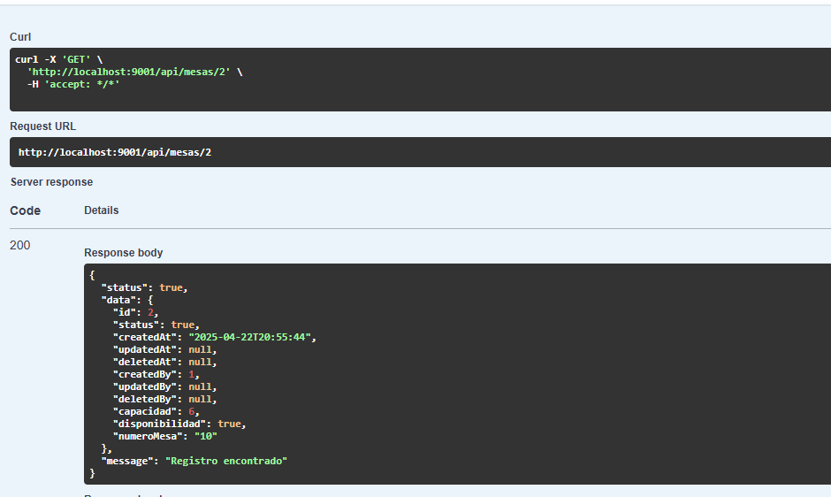

# Historia de Usuario - HU1: Componente de fecha y hora

## Descripción

El objetivo de esta historia de usuario es crear un componente reutilizable que permite seleccionar la fecha y hora para poder realizar reservas. 
## Imagenes



## Estructura

```tsx
interface DateTimePickerProps {
  selectedDate?: string;
  selectedTime?: string;
  onDateChange: (value: string) => void;
  onTimeChange: (value: string) => void;
}

const DateTime: React.FC<DateTimePickerProps> = ({
  selectedDate,
  selectedTime,
  onDateChange,
  onTimeChange,
}) => {
  const [showDatePicker, setShowDatePicker] = useState(false);
  const [showTimePicker, setShowTimePicker] = useState(false);

  const formatTime = (isoString?: string) => {
    if (!isoString) return 'Seleccionar hora';
    try {
      const date = new Date(isoString);
      return date.toLocaleTimeString([], { hour: '2-digit', minute: '2-digit', hourCycle: 'h23' });
    } catch {
      return 'Seleccionar hora';
    }
  };

  return (
    <div className="date-time-container">
      <IonItem lines="none">
        <IonLabel position="stacked">Fecha de la Reserva</IonLabel>
        <IonButton
          onClick={() => setShowDatePicker(!showDatePicker)}
          expand="block"
          fill="outline"
          style={{ color: '#000', borderColor: '#000' }}
        >
          {selectedDate
            ? new Date(selectedDate).toLocaleDateString('es-ES')
            : 'Seleccionar fecha'}
        </IonButton>
        {showDatePicker && (
          <IonDatetime
            value={selectedDate}
            onIonChange={(e) => {
              onDateChange(e.detail.value! as string);
              setShowDatePicker(false);
            }}
            presentation="date"
          />
        )}
      </IonItem>

      <IonItem lines="none">
        <IonLabel position="stacked">Hora de la Reserva</IonLabel>
        <IonButton
          onClick={() => setShowTimePicker(!showTimePicker)}
          expand="block"
          fill="outline"
          style={{ color: '#000', borderColor: '#000' }}
        >
          {formatTime(selectedTime)}
        </IonButton>
        {showTimePicker && (
          <IonDatetime
            value={selectedTime}
            onIonChange={(e) => {
              onTimeChange(e.detail.value! as string);
              setShowTimePicker(false);
            }}
            presentation="time"
            hour-cycle="h23"
          />
        )}
      </IonItem>
    </div>
  );
};

export default DateTime;
```


## Historia de Usuario - HU2: Ingreso de los datos de el cliente

## Descripción 
Este componente permite capturar de manera sencilla y eficiente los datos personales de un cliente que desea realizar una reserva. Está diseñado para ser reutilizable en diferentes partes de la aplicación, facilitando su integración en múltiples formularios o flujos relacionados con reservas.

## imagenes


## Estructura

```tsx

// src/components/MyInput.tsx
import { IonInput, IonLabel, IonItem } from '@ionic/react';

type TextFieldTypes =
  | 'date'
  | 'email'
  | 'number'
  | 'password'
  | 'search'
  | 'tel'
  | 'text'
  | 'time'
  | 'url';

interface MyInputProps {
  label: string;
  type?: TextFieldTypes;
  value: string;
  onChange: (value: string) => void;
}

const Formulario: React.FC<MyInputProps> = ({ label, type = 'text', value, onChange }) => {
  return (
    <IonItem>
      <IonLabel position="stacked">{label}</IonLabel>
      <IonInput
        type={type}
        value={value}
        onIonChange={(e) => onChange(e.detail.value!)}
        clearInput
        style={{ color: "#000" }}
      />
    </IonItem>
  );
};

export default Formulario;
```


# Historia de Usuario - HU3: Componente para seleccionar la mesa

## Descrpción 

Este componente permite capturar de manera sencilla y eficiente la información relacionada con la selección de mesas por parte de un cliente que desea realizar una reserva. Está diseñado para ser reutilizable en distintas secciones de la aplicación, facilitando su integración en formularios o flujos donde se requiera elegir una mesa disponible.

## Imagenes


## Estructura
```tsx
import React from 'react';
import {
  IonItem,
  IonLabel,
  IonList,
  IonRadioGroup,
  IonRadio,
  IonCard,
  IonCardHeader,
  IonCardTitle
} from '@ionic/react';

interface Mesa {
  id: number;
  nombre: string;
  capacidad: number;
  disponible: boolean;
}

interface MesaSelectorProps {
  mesas: Mesa[];
  selectedMesaId?: number;
  onSelectMesa: (id: number) => void;
}

const mesaSelector: React.FC<MesaSelectorProps> = ({
  mesas,
  selectedMesaId,
  onSelectMesa
}) => {
  return (
    <IonCard className="card-container">
      <IonCardHeader>
        <IonCardTitle>Selecciona una Mesa</IonCardTitle>
      </IonCardHeader>

      <IonList>
        <IonRadioGroup
          value={selectedMesaId?.toString()}
          onIonChange={(e) => onSelectMesa(parseInt(e.detail.value as string))}
        >
          {mesas
            .filter((mesa) => mesa.disponible)
            .map((mesa) => (
              <IonItem key={mesa.id}>
                <IonLabel>
                  {mesa.nombre} (Capacidad: {mesa.capacidad})
                </IonLabel>
                <IonRadio slot="end" value={mesa.id.toString()} />
              </IonItem>
            ))}
        </IonRadioGroup>
      </IonList>
    </IonCard>
  );
};

export default mesaSelector;
```
# Historia de Usuario - HU1: Componente de fecha y hora

## Descripción 
Esta HU nos muestra como se utilizaron los 3 componentes en una pantalla principal.

## imagenes 


## Codigo 
```tsx
import {
  IonButton,
  IonContent,
  IonHeader,
  IonPage,
  IonTitle,
  IonToolbar,
} from '@ionic/react';

import ExploreContainer from '../components/ExploreContainer';
import Formulario from '../components/Formulario';
import DateTime from '../components/fechaHora';
import MesaSelector from '../components/mesaSelector';

import { useState } from 'react';
import MyButton from '../components/MyButton';

const mesasMock = [
  { id: 1, nombre: 'Mesa 1', capacidad: 4, disponible: true },
  { id: 2, nombre: 'Mesa 2', capacidad: 2, disponible: false },
  { id: 3, nombre: 'Mesa 3', capacidad: 6, disponible: true },
];

const Home: React.FC = () => {
  const [nombre, setNombre] = useState('');
  const [Contacto, setContacto] = useState('');
  const [Identificacion, setIdentificacion] = useState('');
  const [direccion, setDireccion] = useState('');

  const [date, setDate] = useState<string>('');
  const [time, setTime] = useState<string>('');

  const [mesaSeleccionada, setMesaSeleccionada] = useState<number>();

  function enviarFormulario() {
    if (
      nombre.trim() === '' ||
      Contacto.trim() === '' ||
      Identificacion.trim() === '' ||
      !date ||
      !time ||
      !mesaSeleccionada
    ) {
      alert('Todos los campos son obligatorios');
    } else {
      alert('Reserva enviada con éxito');
      console.log('Datos enviados:', {
        nombre,
        Contacto,
        Identificacion,
        fecha: date,
        hora: time,
        mesaId: mesaSeleccionada,
      });
    }
  }

  return (
    <IonPage>
      <IonHeader>
        <IonToolbar>
          <IonTitle>GESTION</IonTitle>
        </IonToolbar>
      </IonHeader>

      <IonContent fullscreen>
        <div className="contenedor ion-padding">

          {/* Cliente */}
          <Formulario label="Nombre" value={nombre} onChange={setNombre} />
          <Formulario label="Contacto" value={Contacto} onChange={setContacto} />
          <Formulario label="Identificación" value={Identificacion} onChange={setIdentificacion} />
          <Formulario label="Direccion" value={direccion} onChange={setDireccion} />

          {/* Fecha y hora */}
          <DateTime
            selectedDate={date}
            selectedTime={time}
            onDateChange={setDate}
            onTimeChange={setTime}
          />

          {/* Selección de mesa */}
          <MesaSelector
            mesas={mesasMock}
            selectedMesaId={mesaSeleccionada}
            onSelectMesa={setMesaSeleccionada}
          />

          {/* Botón de enviar */}
          <MyButton text="Enviar Reserva" onClick={enviarFormulario} />

          <ExploreContainer />
        </div>
      </IonContent>
    </IonPage>
  );
};

export default Home;
```